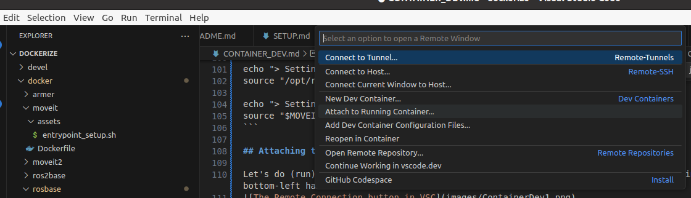

# Workshop: Containerized Development with Docker and Visual Studio Code

## Pre-requisite
The following should have been installed in a computer
- [Docker Engine](https://docs.docker.com/engine/install/ubuntu/) and [Docker Compose Plugin](https://docs.docker.com/compose/install/linux/)(or the [Docker Desktop](https://www.docker.com/products/docker-desktop/) for your platform).
- Visual Studio Code with the plugin [Remote Connection](https://marketplace.visualstudio.com/items?itemName=ms-vscode-remote.vscode-remote-extensionpack).
- The `dockerize` package downloaded to a folder (preferably `~/dockerize`) on your computer.

## Background
This little workshop takes us through the setup of containerized development for a new project.

The aim of the toy project is to test arm movement of a UR10 simulator with the Moveit Python API called Moveit commander. 

## Create a New Service (Container) using the Moveit Image

1. In the dockerize root folder, open the file docker-compose.yaml, and add a new service `workshop` at the end. Save the file.

```
    workshop:
        # image: nvidia/cudagl:11.3.0-devel
        image: moveit
        container_name: workshop
        devices:
            - /dev/dri
        group_add:
            - video
        stdin_open: true
        tty: true
        privileged: true
        environment:
            - DISPLAY
            - QT_X11_NO_MITSHM=1
            - ROS_MASTER=true
            - ROS_MASTER_URI=http://localhost:11311
        network_mode: host
        ipc: host
        volumes:
            - /tmp/.X11-unix:/tmp/.X11-unix:rw
            - /etc/timezone:/etc/timezone:ro
            - /etc/localtime:/etc/localtime:ro
            - ~/.ssh:/home/qcr/.ssh 
        command:
            bash
```
Change `ROS_MASTER=true` if your host computer already has `roscore` running.

2. In a terminal window, cd to the `dockerize` folder. Build the `workshop` image.
```
docker compose build workshop
```

3. Start the service `workshop` with docker compose. The container will start in the non-interactive mode.
```
docker compose up workshop
```
Run the following to list the containers
```
docker container ls
```

4. We can gain access to a command shell of the container using the command below.
```
docker compose exec workshop bash  # in the dockerize folder or

docker exec -it workshop bash # from anywhere
```
## Working in the Container

The `moveit` image has already loaded with configuration files of panda for motion planning moveit integration.

In the container's shell, start the panda motion planning rviz node.
```
roslaunch panda_moveit_config demo.launch
```
> Some terminals running the container's shell and others running the host computer's shell can be confusing. The user `qcr` is setup as a hint for users to tell one from another.

Note that the image `moveit` has included commands that build the workspace and source the packages.
- Build the workspace: look into the Dockerfile for `moveit`
```
# workspace create and make for moveit_ws 
RUN mkdir -p ${MOVEIT_WS}/src
RUN cd ${MOVEIT_WS}/src && \
    git clone https://github.com/ros-planning/moveit_tutorials.git -b master
RUN cd ${MOVEIT_WS}/src && \
    git clone https://github.com/ros-planning/panda_moveit_config.git -b noetic-devel 

RUN cd ${MOVEIT_WS} && rosdep install --from-paths src --ignore-src -r -y --rosdistro ${ROS_DISTRO} 
RUN source /opt/ros/${ROS_DISTRO}/setup.bash && \
    cd ${MOVEIT_WS} && \
    catkin_make -DPYTHON_EXECUTABLE=/usr/bin/python3

# workspace create for cgras_moveit_ws
RUN mkdir -p /home/${USER}/cgras_moveit_ws/src
RUN cd /home/${USER}/cgras_moveit_ws && rosdep install --from-paths src --ignore-src -r -y --rosdistro ${ROS_DISTRO} 
RUN source /opt/ros/${ROS_DISTRO}/setup.bash && \
    cd ${MOVEIT_WS} && \
    catkin_make -DPYTHON_EXECUTABLE=/usr/bin/python3
```
-  Source the packages: look into the file `entrypoint_setup.sh` for `moveit`. This entry-point file is defined in the Dockerfile
```
echo "> Setting up ROS"
source "/opt/ros/$ROS_DISTRO/setup.bash"

echo "> Setting up catkin workspace"
source "$MOVEIT_WS/devel/setup.bash"
```

## Attaching the Container to Visual Studio Code

### Install ipykernel for Python development

Containarized Python development with Visual Studio Code requires the Python executables to be discoverable. To do that, the following Python modules should be installed. Use a container terminal to execute the following command.
```
pip install numpy==1.24.4 notebook==6.5.5 ipykernel jupyros

```

### Starting Remote Coding in Visual Studio Code

Let's do (run) some coding.  Launch Visual Studio Code. Attach the container by pressing the 'Remote Connection' button on the bottom-left hand corner.


In the popup menu, select _Attach to Running Container_.


A list of running container then appears. Select `workshop`. Afterwards, a new VSC window will appear - the application may ask you for the folder to open or it will open the default/the last time.  The best location should be `~/workshop_ws`.

### Creating/Downloading the toy project (a Python robot arm control project)

Let's open a terminal (shell) under Visual Studio Code. From the top-menu bar, select _Terminal_ and then _New Terminal_. A new terminal with the default shell (and entry-point) appears at the bottom of the VSC window.

Normally to create a new package `toy_project` under `workshop_ws`. 

```
cd ~/moveit_ws/src
catkin_create_pkg toy_project std_msgs rospy roscpp
```
Instead of doing the usual create package, here we clone a prepared package from github. To clone the project
```
git clone https://github.com/andrewluiqut/toy_project.git
```
Then install the new package in the catkin workspace.
```
cd ~moveit_ws
catkin_make
source devel/setup.bash
```
Now, we can execute programs in a container shell or run the program interactively. 


## What to Do Next?

Now, we have a container populated with project code ready for deployment. What should we do next?

## Author

Dr Andrew Lui, Senior Research Engineer <br />
Robotics and Autonomous Systems, Research Engineering Facility <br />
Research Infrastructure <br />
Queensland University of Technology <br />