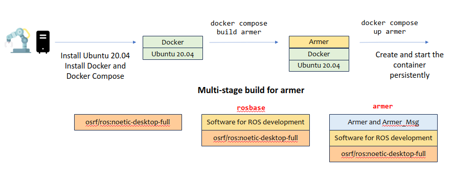

# General Docker Images for Setup of Projects' System Environments

This repo contains files for docker-based setup of system environments. The types of system environments are relevant for project development work of the Robotics and Autonomous Systems (RAS) group and the QUT Centre for Robotics (QCR).

The setup files compose of specifications of layered entities in the docker/docker compose framework, namely, Dockerfiles and Docker-Compose (yaml) files. 

* A Dockerfile specifies the scripts for building a docker image, which is a template of executable system environments. 
* A Docker-Compose (yaml) file specifies the commands for running one or more docker containers based on a docker image. Each executing instance is known as a service. Optionally it comprises the specifications for building docker images, connecting to prescribed system services, disk volumes, and other system entities.

## List of Supported Docker Images

Currently the image specifications mainly emerge from development of robotic applications with ROS. More docker image specifications will be added to this repo.

| Images | Remarks | Depends on |
| ------------- | ------------- | ------ |
| `rosbase`  | ROS 1 (Noetic) + Ubuntu 20.04  | Nil       |
| `nvidia`  | Ubuntu 20.04 with Nvidia drivers  | Nil   |
| `rosbase-gpu` | ROS 1 (Noetic) + Nvidia | `rosbase` |
| `armer` | ROS 1 (Noetic)+ Armer | `rosbase` |
| `moveit` | ROS 1 (Noetic) + Moveit version 1 | `rosbase` |
| `ros2base` | ROS 2 (Humble) + Ubuntu 22.04 | Nil |
| `moveit2` | ROS 2 (Humble) + Moveit version 2 | `ros2base` |

## File Organization

The repo comprises of two sub-directories, namely, `devel` and `docker`. 

* `devel`: contains files for demonstrating container-based development in Visual Studio Code.
* `docker`: contains files for specifying docker images, including Dockerfiles and assets (files) for the images.

### The file: docker-compose.yaml 

This file contains commands for starting up docker services using the docker compose command suite. A docker service is an executing container cloned from an image. The file `docker-compose.yaml` is handy for orchestrating one or more services that work together for a project, in addition, specifies supporting components of the services and parameters pertinant to the environment.

The file has a tree structure, and the top level branches to different services. Each service sub-branch contains various information on how to start the service, such as the image, the devices used including the input/output, network, and GPU, the volumes to mount in the container's file system. 

[Compose specification with the compose file](https://docs.docker.com/compose/compose-file/03-compose-file/)

### The directories under `docker`

Every directories under `docker` contains files relevant for building one image or a family of similar images. They share a similar structure and key entities including the followings.

* Dockerfile: a layer-by-layer list of commands for building a system environment as an image. 
* The 'assets' folder: files to be added to the image as specified in the Dockerfile.
- The `entrypoint_setup.sh`: the script file specified in a Dockerfile that initializes the container (system environment).

[Dockerfile reference](https://docs.docker.com/engine/reference/builder/)

## Pre-requisites

To exploit docker images in the platform setup for a project, simply start with a base OS platform (Linux, Windows, or MacOS) installed with the suite of Docker Engine, Docker CLI and Docker Compose. 

Refer to the [Docker installation page](./DOCKER_INSTALL.md) provided in this repo.

Once the installation is successfully completed, the docker engine should be running in the background (as a service or daemon).

## Building and Running Images

Image building and running are supported in the vanilla docker engine and also the docker compose tools. The latter is easier to use if the commands and parameters have been specified in a docker-compose yaml file.

### Building images using docker-compose

The following commands build the `rosbase` and `armer` images. Note that `armer` has specified `rosbase` as the base image in the Dockerfile. The `rosbase` must be built first. 

```
docker compose build rosbase
docker compose build armer
```


There are at least two ways to create a new container (an instance of executing image) and execute it.

Using docker compose up
```
docker compose up armer
```
Using docker compose run (to start an interactive shell). The `-it` flags refer to the `tty` and `stdin_open` settings in the docker compose yaml file. 
```
docker compose run -it armer
```
Note that the `armer` service extends the `rosbase` service and therefore it inherits the settings of the base service.

Use docker compose down to terminate a container.
```
docker compose down
```
The terminated container goes into a dormant state, which can be later restarted with all the environment elements intact. The following lists the containers and their information.
 ```
 docker container ls
 ```
To execute commands on a currently running container, use docker compose exec. The following command starts a bash shell in the currently running container called `armer`.
```
docker compose exec armer bash
```
Refer to [Docker Compose CLI reference](https://docs.docker.com/compose/reference/) for details of all available docker compose commands.

### Docker CLI and Docker Compose CLI

Docker compose is a plugin or a tool on top of the __origin__ Docker Engine. The __origin__ Docker CLI commands are useful for managing images and containers.  For example to list all containers, use the following
```
docker container ls
```
To remove all stopped containers, use the following. Beware that removing a container means that it cannot be restarted and any change made to the container will be lost.
```
docker container prune
``` 

Note that the compose function only works within the local directory (where the docker compose yaml has been specified). If a container has been created for a composed image, simply use the default Docker commands (i.e., docker exec or run) to interact with the running container (if outside the context of the compose folder)

Refer to the [Docker CLI reference documentation](https://docs.docker.com/engine/reference/commandline/container_ls/) for all the available commands.

## Comparision between Docker Compose and Dockerfile

Essentially, Docker Compose makes running images (as containers) easier. An example based on the `rosbase` image (ROS 1) is given below. First build the `rosbase` image using a Dockerfile in the same folder.
```
docker build -f Dockerfile -t rosbase .
```

The following command will run the `rosbase` image (assumed that the image has already been built)
```
docker run rosbase
```
The container will function but some critical features are missing such as network capability, file volume mounts, locale and graphics. The following will enable the sharing of the host networking capability, the timezone/locale settings, X11, etc with the container. 
```
docker run -it --net=host \
    --env="NVIDIA_DRIVER_CAPABILITIES=all" \
    --env="DISPLAY" \
    --env="QT_X11_NO_MITSHM=1" \
    --env="ROS_MASTER=true" \
    --env="ROS_MASTER_URI=http://localhost:11311"
    --volume="/tmp/.X11-unix:/tmp/.X11-unix:rw" \
    --volume="/etc/timezone:/etc/timezone:ro" \
    --volume="/etc/localtime:/etc/localtime:ro" \
    rosbase \
    bash
```
The troublesome long command is not desirable. This is where Docker Compose can come to the rescue. The command can be transformed as a Docker Compose service and specified in a docker compose yaml file. The following contains the configurations in the above long command and more.
```
version: '3'
services:
    rosbase:
        build:
            context: ./docker/rosbase
            dockerfile: Dockerfile
            args: 
                USER: qcr
        image: rosbase
        container_name: rosbase
        stdin_open: true
        tty: true
        privileged: true
        environment:
            - DISPLAY
            - QT_X11_NO_MITSHM=1
            - ROS_MASTER=false
            - ROS_MASTER_URI=http://localhost:11311
        network_mode: host
        ipc: host
        user: qcr
        working_dir: /home/qcr
        volumes:
            - /tmp/.X11-unix:/tmp/.X11-unix:rw
            - /etc/timezone:/etc/timezone:ro
            - /etc/localtime:/etc/localtime:ro
        command: bash
``` 

## Creating New Images for a Project

Refer to the [Setup of New Image](./SETUP.md) for suggestions and tips.

## Author

Dr Andrew Lui, Senior Research Engineer <br />
Robotics and Autonomous Systems, Research Engineering Facility <br />
Research Infrastructure <br />
Queensland University of Technology <br />