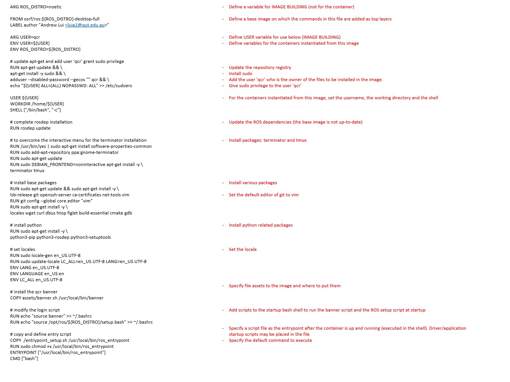

# Setup New Images and Services for a (ROS) Project

A project may use one or more docker images to manage diversity in system environments and configurations. For example, one can build a ROS 1 image and a ROS 2 image for certain applications/drivers that are tied to the respective ROS versions. After resolving the ROS 1 bridging issue, docker compose can then be applied to start the two images on a host computer.

The appropriate number of images and what constitute a __good__ image is not discussed in detail here. Some tips are given below.

* Applications/services that share the same system environment and are likely to be needed together (forming a logical component) can be packaged in the same image.
* An application/service that 
* Two versions of the same application/service can be packaged in two different images for ease of switching-over and testing. 

## Creating an Image for a Project

Docker supports efficient setup of system environments for project development, testing, and deployment, and ensures consistency in configurations for successful execution of applications and services. Docker images make the above possible. With docker images, the respective system environments can be re-created on any host computer that has been installed with the Docker Engine.

There are two main approaches of image creation
* Scripting: create a Dockerfile that specifies the commands used in setting up the container.
* Commit-container: create an image from a running container. For example, one can start with a __clean slate__ such as a ubuntu image, add packages and modify system files for execution of an application/service. The running container can be turned into an image using the `docker commit` command.

The commit-container approach is handy in some cases when writing a Dockerfile is not desirable and the system setup process expects a lot of twists and turns. The downside is that that image size can be huge and the lack of documentation removes the possibility of automating the image build process.

## Suggested Steps of Scripting a Dockerfile for a New Image

### Step 1: Select a base image

Docker images are likened to layers of system resources/configurations. Each command in the Dockerfile adds a layer to the image.

The base image specifies a base as a starting point from which additional layers are placed upon. One can use a custom-built image as the base, for example, `rosbase` is a handy base image for building images running ROS 1. One can also use a publicly available pre-built image. The [Docker Hub](https://hub.docker.com/), for example, hosts hundred of images ranging from host operating systems to web servers. Some hosted images are provided by produce and software manufacturers.

#### Trying out a pre-built image from Docker Hub

It is easy to try any pre-built image from Docker Hub - just pull and run an image with the following commands.
```
docker pull osrf/ros:noetic-desktop-full

docker run -it --net=host osrf/ros:noetic-desktop-full bash
```

### Multiple-stage builds and Multi-platform images

Docker supports multi-stage builds, in which the Dockerfile can use multiple base images and select different assets from them for the new image. 

Refer to [Docker Multi-stage Build](https://docs.docker.com/build/building/multi-stage/) for more details.

A docker image can be specified for multiple platforms. Each image can contain variants for specific platforms and operating systems.

Refer to [Docker Multi-platform Images](https://docs.docker.com/build/building/multi-platform/) for more details.
 
### Step 2: Specify variables for image building and variables for the running containers 

Consider the variables and parameters required for the running containers from this image. These may include ROS environment variables, paths to libraries, etc.

Variables can also be defined for better management of the scripts/commands in Dockerfiles. For example, file paths are defined for consistency between commands for downloading and installation.

### Step 3: Specify package installations

Binaries and source code installation is a means of adding system resources. The former can be done through package/application management provided by the host OS. The example below installs several packages from the Ubuntu's repositories.
```
RUN sudo apt-get update && sudo apt-get install -y \
lsb-release \
git \
openssh-server \
ca-certificates \
net-tools \
vim
```
Source code installation usually comprises of, firstly, downloading the source from repos like Github, and executing a make/compilation process. The following example of armer installation illustrates this 2-stage process.
```
# install armer workspace
RUN mkdir -p ${ARMER_WS}/src
RUN cd ${ARMER_WS}/src && \ 
git clone https://github.com/qcr/armer.git && \
git clone https://github.com/qcr/armer_msgs

# add ros dependency
RUN cd ${ARMER_WS} && rosdep install --from-paths src --ignore-src -r -y --rosdistro ${ROS_DISTRO} 

# workspace create and make 
RUN source /opt/ros/${ROS_DISTRO}/setup.bash && \
cd ${ARMER_WS} && \
catkin_make -DPYTHON_EXECUTABLE=/usr/bin/python3
```
### Step 4: Add user and specify working directory, shell, locale, and startup scripts

These essential configurations are often similar between images and it is suggested to copy from another Dockerfile and modify as needed.

## Illustration of common commands in Dockerfiles

The following illustrates commands for specifying the `rosbase` image.



## Author

Dr Andrew Lui, Senior Research Engineer <br />
Robotics and Autonomous Systems, Research Engineering Facility <br />
Research Infrastructure <br />
Queensland University of Technology <br />